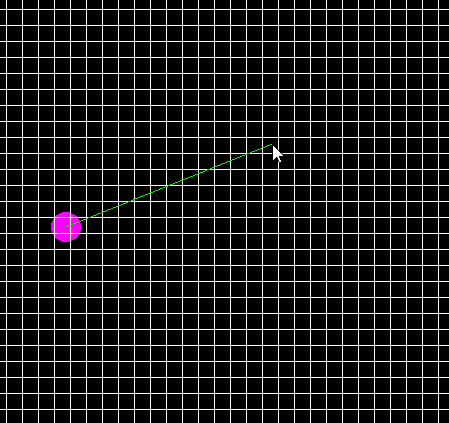

# DDA-Digital Differential Analyzer

Built with SFML

An attempt into DDA algorithm, it's not complete nor optimized, even more the implementation might be worng :D.

DDA is an alogorithm used to determine the point of intercetion in computer renderd graphics.

Project was made in 28/2/2023.
